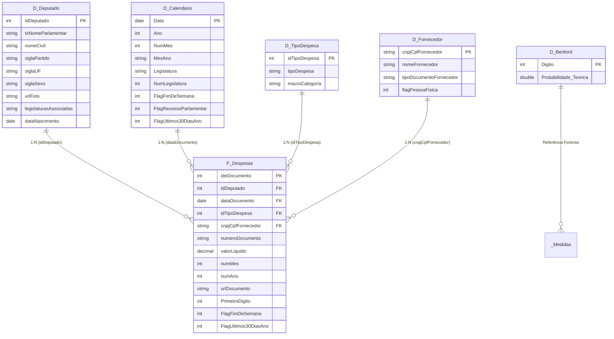

# 🏛️ Câmara Analytics | Plataforma Corporativa de Engenharia Analítica, Auditoria Forense & Big Data da CEAP (2008 – 2026+)

[](https://powerbi.microsoft.com/)
[](https://learn.microsoft.com/dax/)
[](https://learn.microsoft.com/power-query/)
[](https://en.wikipedia.org/wiki/Benford%27s_law)
[](https://git-scm.com/)
[]()

---

## 📋 Sumário Executivo
1. [Visão Geral & Problema de Negócio](#-visão-geral--problema-de-negócio)
2. [Arquitetura de Dados Desacoplada (PBIP / TMDL / PBIR)](#-arquitetura-de-dados-desacoplada-pbip--tmdl--pbir)
3. [Estratégia de Ingestão Dinâmica & Pruning de Memória](#-estratégia-de-ingestão-dinâmica--pruning-de-memória)
4. [Modelagem Dimensional Escalável (Star Schema Histórico)](#-modelagem-dimensional-escalável-star-schema-histórico)
5. [Motor de Auditoria Forense em DAX (Normalização contra Inflação)](#-motor-de-auditoria-forense-em-dax-normalização-contra-inflação)
   - [Z-Score Anualizado por Categoria](#1-z-score-anualizado-por-categoria-anulando-falsos-positivos-inflacionários)
   - [IQR Anualizado (Distância Interquartil Não-Paramétrica)](#2-iqr-anualizado-distância-interquartil-não-paramétrica)
   - [Auditoria de 1º Dígito via Lei de Benford com MAD de Nigrini](#3-auditoria-de-1º-dígito-via-lei-de-benford-com-mad-de-nigrini)
   - [Sinais de Alerta Contábeis (Red Flags)](#4-sinais-de-alerta-contábeis-red-flags)
6. [Catálogo das Páginas do Relatório (PBIR)](#-catálogo-das-páginas-do-relatório-pbir)
7. [📘 MANUAL DE MANUTENÇÃO & ATUALIZAÇÃO CONTÍNUA (COMO AVANÇAR OS ANOS)](#-manual-de-manutenção--atualização-contínua-como-avançar-os-anos)
8. [Guia de Instalação e Execução Passo a Passo](#-guia-de-instalação-e-execução-passo-a-passo)
9. [Roteiro de Mídia para Portfólio (Screenshots & GIFs)](#-roteiro-de-mídia-para-portfólio-screenshots--gifs)
10. [Pitch de Negócios / Posicionamento Profissional (gilliardfernandes.com)](#-pitch-de-negócios--posicionamento-profissional-gilliardfernandescom)

---

## 🎯 Visão Geral & Problema de Negócio

A **Cota para o Exercício da Atividade Parlamentar (CEAP)** reembolsa mensalmente gastos de exercício do mandato de deputados federais (passagens, combustíveis, consultorias técnicas, divulgação, alimentação e hospedagem).

Com registros consolidados desde **2008 até a atualidade (2026+)**, são **mais de 18 anos contínuos de despesas públicas**, totalizando centenas de milhões de reais e dezenas de milhões de notas fiscais.

### Desafios de Engenharia Analítica Superados
1. **Volumetria Massiva sem Estouro de Memória:** Carregar dezenas de milhões de linhas com 30+ colunas sobrecarrega estações de trabalho e inviabiliza atualizações. Implementamos uma função modular em M com *severe column pruning*, retendo apenas as colunas essenciais para o modelo analítico e garantindo alta taxa de compressão no motor VertiPaq.
2. **Distorção Inflacionária Histórica:** Uma despesa de R$ 5.000 em 2008 possuía poder de compra muito superior a R$ 5.000 em 2026. Cálculos estatísticos globais gerariam falsos positivos nos anos recentes e ignorariam desvios no passado. Desenvolvemos **Z-Score e IQR anualizados** (particionados por ano e categoria).
3. **Governança e Perenidade:** Eliminação do binário opaco `.pbix` e adoção de código aberto versionável (**PBIP + TMDL + PBIR**), pronto para equipes corporativas, CI/CD e atualizações anuais sem necessidade de refatorar código.

---

## 🏗️ Arquitetura de Dados Desacoplada (PBIP / TMDL / PBIR)

O projeto foi totalmente remodelado no padrão **Microsoft Fabric / Power BI Project**:

```
deputy-spending-analytics/
├── Camara_Analytics.pbip                    # Manifesto raiz do projeto PBIP
├── Camara_Analytics.SemanticModel/          # Modelo Semântico declarativo em TMDL
│   ├── definition.pbism                     # Metadados de conexão do dataset
│   └── definition/
│       ├── database.tmdl                    # Compatibilidade tabular (Level 1600)
│       ├── model.tmdl                       # Cultura pt-BR, anotações e registro de tabelas
│       ├── expressions.tmdl                 # Parâmetros dinâmicos (AnoInicial, AnoFinal) e fxObterDespesasPorAno
│       ├── relationships.tmdl               # Relacionamentos Star Schema formais 1:N
│       ├── cultures/pt-BR.tmdl              # Localização e cultura regional
│       └── tables/                          # Tabelas e medidas em sintaxe TMDL pura
│           ├── F_Despesas.tmdl              # Fato com consolidação dinâmica de qualquer período (2008 a 2026+)
│           ├── D_Deputado.tmdl              # Dimensão de parlamentares enriquecida (legislaturas, fotos, dados)
│           ├── D_Calendario.tmdl            # Calendário DAX dinâmico (2008 a 2026+) com hierarquia de Legislaturas
│           ├── D_TipoDespesa.tmdl           # Padronização de 22 subcotas históricas e Macro-Categorias
│           ├── D_Fornecedor.tmdl            # Fornecedores únicos e tipo de documento (CNPJ/CPF)
│           ├── D_Benford.tmdl               # Tabela analítica de dígitos 1 a 9 para auditoria forense
│           └── _Medidas.tmdl                # Repositório de 40+ medidas de auditoria, tempo e red flags
├── Camara_Analytics.Report/                 # Relatório no padrão moderno PBIR
│   ├── definition.pbir                      # Vínculo com o SemanticModel
│   └── definition/
│       ├── report.json                      # Configurações globais, tema e engine de query
│       └── pages/
│           ├── pages.json                   # Metadados e ordenação das páginas
│           ├── 01_linha_tempo_historica/    # Página 1: Linha do Tempo & Macrotendências (2008-Atual)
│           ├── 02_painel_auditoria_fraudes/ # Página 2: Auditoria Forense (Benford & Outliers)
│           ├── 03_raio_x_parlamentar/       # Página 3: Raio-X do Parlamentar na História
│           └── 04_fornecedores_risco/       # Página 4: Fornecedores de Risco e Redes de Contato
├── data/                                    # Dados locais (CSVs brutos e amostras)
│   └── sample/                              # Amostras reais de marcos históricos (2008 a 2024)
└── scripts/                                 # Utilitários de automação em Python
    ├── download_data.py                     # Downloader flexível multianual com argumentos CLI
    ├── generate_sample_data.py              # Extrator de amostras representativas
    └── validate_model.py                    # Validador automatizado de TMDL, PBIR e estatística
```

---

## ⚡ Estratégia de Ingestão Dinâmica & Pruning de Memória

### 1. Parâmetros de Carga Dinâmicos (`expressions.tmdl`)
* **`AnoInicial`**: Inteiro (configurado por padrão como `2008`, o início histórico da CEAP).
* **`AnoFinal`**: Inteiro (configurado por padrão como `2026`, o exercício atual).

### 2. Função Modular com Pruning Severo (`fxObterDespesasPorAno`)
Para cada ano gerado por `List.Numbers(AnoInicial, (AnoFinal - AnoInicial) + 1)`:
1. Conecta-se à URL consolidada oficial `https://dadosabertos.camara.leg.br/arquivos/despesas/csv/Ano-{ano}.csv` (com fallback para `Ano-{ano}.csv.zip` e arquivos locais em `./data/Ano-{ano}.csv`).
2. **Pruning Imediato:** Das 32 colunas originais do dump da Câmara, 20 colunas de metadados redundantes são descartadas logo no segundo passo da consulta M, retendo apenas:
   - `ideDocumento`, `ideCadastro`/`nuDeputadoId`, `datEmissao`, `numSubCota`, `txtDescricao`, `txtCNPJCPF`, `txtFornecedor`, `txtNumero`, `vlrDocumento`, `vlrGlosa`, `vlrLiquido`, `numMes`, `numAno`, `urlDocumento`.
3. **Resiliência com `try ... otherwise`:** Caso a API governamental apresente instabilidade temporária para um determinado ano, a função retorna uma tabela vazia tipada, permitindo que os demais anos completem o refresh sem abortar a atualização global.

---

## 🌟 Modelagem Dimensional Escalável (Star Schema Histórico)

O modelo foi projetado com grão no nível do documento fiscal (1 fato e 4 dimensões conectadas em 1:N com integridade referencial estrita):



---

## 🔬 Motor de Auditoria Forense em DAX (Normalização contra Inflação)

### 1. Z-Score Anualizado por Categoria (Anulando Falsos Positivos Inflacionários)
Para neutralizar a inflação histórica acumulada ao longo de quase duas décadas, o cálculo do Z-Score particiona dinamicamente os registros por **Ano** e por **Categoria de Despesa**:

$$Z = \frac{X - \mu_{\text{ano, categoria}}}{\sigma_{\text{ano, categoria}}}$$

* Uma nota é comparada **exclusivamente contra os seus pares contemporâneos emitidos no mesmo ano e para o mesmo tipo de gasto**.
* Notas com $|Z| > 3.0$ configuram **anomalias estatísticas severas** ($p < 0.0027$).
* **Implementação em DAX:**
```dax
Média Despesa Ano Categoria = 
CALCULATE(
    AVERAGE('F_Despesas'[valorLiquido]),
    ALLEXCEPT('F_Despesas', 'F_Despesas'[numAno], 'F_Despesas'[idTipoDespesa]),
    'F_Despesas'[valorLiquido] > 0
)

Desvio Padrão Ano Categoria = 
CALCULATE(
    STDEV.S('F_Despesas'[valorLiquido]),
    ALLEXCEPT('F_Despesas', 'F_Despesas'[numAno], 'F_Despesas'[idTipoDespesa]),
    'F_Despesas'[valorLiquido] > 0
)

Z-Score Anualizado = 
VAR _Valor = SELECTEDVALUE('F_Despesas'[valorLiquido])
VAR _Media = [Média Despesa Ano Categoria]
VAR _Desvio = [Desvio Padrão Ano Categoria]
RETURN
    IF(
        NOT ISBLANK(_Valor) && NOT ISBLANK(_Desvio) && _Desvio > 0,
        DIVIDE(_Valor - _Media, _Desvio),
        BLANK()
    )
```

### 2. IQR Anualizado (Distância Interquartil Não-Paramétrica)
Para lidar com categorias de forte assimetria e cauda pesada (ex: consultorias, locação de aeronaves), o IQR anualizado calcula barreiras robustas:

$$\text{IQR}_{\text{ano, cat}} = Q_3 - Q_1$$
$$\text{Limite Superior} = Q_3 + 1.5 \times \text{IQR}_{\text{ano, cat}}$$

```dax
Q1 Ano Categoria = 
CALCULATE(
    PERCENTILE.INC('F_Despesas'[valorLiquido], 0.25),
    ALLEXCEPT('F_Despesas', 'F_Despesas'[numAno], 'F_Despesas'[idTipoDespesa]),
    'F_Despesas'[valorLiquido] > 0
)

Q3 Ano Categoria = 
CALCULATE(
    PERCENTILE.INC('F_Despesas'[valorLiquido], 0.75),
    ALLEXCEPT('F_Despesas', 'F_Despesas'[numAno], 'F_Despesas'[idTipoDespesa]),
    'F_Despesas'[valorLiquido] > 0
)

IQR Ano Categoria = [Q3 Ano Categoria] - [Q1 Ano Categoria]

Limite Superior IQR Anual = [Q3 Ano Categoria] + 1.5 * [IQR Ano Categoria]
```

### 3. Auditoria de 1º Dígito via Lei de Benford com MAD de Nigrini
A **Lei de Benford** define a distribuição de probabilidade logarítmica esperada para o primeiro dígito em lançamentos financeiros legítimos:

$$P(d) = \log_{10}\left(1 + \frac{1}{d}\right) \quad \text{para } d \in \{1, \dots, 9\}$$

O modelo calcula a **Frequência Observada** versus a **Frequência Teórica** e avalia o desvio pelo **MAD de Nigrini**:

$$\text{MAD} = \frac{1}{9}\sum_{d=1}^9 \left| \text{Freq Observada}(d) - P(d) \right|$$

* **Interpretação Forense no Power BI:**
  - $\text{MAD} \le 0.006$: Conformidade Estrita (Padrão natural).
  - $0.006 < \text{MAD} \le 0.012$: Conformidade Aceitável.
  - $0.012 < \text{MAD} \le 0.015$: Conformidade Marginal.
  - $\text{MAD} > 0.015$: **Alerta Forense (Alto Risco de Fraude / Manipulação Artificial de Recibos)**.

Graças ao Star Schema, o visual de Benford recalcula dinamicamente para qualquer **Legislatura específica**, **Deputado** ou **Fornecedor** selecionado!

### 4. Sinais de Alerta Contábeis (Red Flags)
* **Recibos com Centavos Zero (.00):** Medida `% Notas Centavos Zero` monitora repetição incomum de notas fiscais com valores redondos sem centavos.
* **Gastos em Recesso Parlamentar:** Despesas solicitadas nos meses de Janeiro e Julho (`FlagRecessoParlamentar`), períodos sem sessões ordinárias no Congresso Nacional.
* **Concentração de Dezembro:** Aceleração de gastos nos últimos 30 dias de cada ano de exercício orçamentário.
* **Score de Risco Multianual (0 a 100):** Medida combinada consolidando as infrações estatísticas.

---

## 📊 Catálogo das Páginas do Relatório (PBIR)

1. **`01_linha_tempo_historica` (Linha do Tempo & Macrotendências):**
   - Série temporal contínua de 2008 a 2026 com marcadores de início e fim de cada Legislatura (53ª a 57ª).
   - Variação YoY%, Média Anual por Deputado e comparativo de despesas por Bancada Partidária.
2. **`02_painel_auditoria_fraudes` (Auditoria Forense & Lei de Benford):**
   - Gráfico combinado de Benford (Real vs Teórico 1 a 9) com segmentadores por Legislatura e Categoria.
   - Matriz forense de transações anômalas com $Z > 3$ e IQR estourados, com link clicável direto para a NF oficial.
3. **`03_raio_x_parlamentar` (Raio-X do Parlamentar na História):**
   - Análise longitudinal da trajetória de deputados reeleitos em múltiplos mandatos.
   - Foto oficial do parlamentar, curva de evolução orçamentária e lista dos fornecedores mais recorrentes.
4. **`04_fornecedores_risco` (Fornecedores de Risco e Redes de Contato):**
   - Relação de empresas que receberam recursos contínuos de dezenas de parlamentares diferentes.
   - Alertas de alta concentração de valores redondos (.00) e despesas em finais de semana/recesso.

---

## 📘 MANUAL DE MANUTENÇÃO & ATUALIZAÇÃO CONTÍNUA (COMO AVANÇAR OS ANOS)

Este projeto foi construído para ser **autossustentável ao longo do tempo**. Conforme novos anos chegarem (2027, 2028, etc.), siga o roteiro abaixo para manter o BI atualizado:


### 1. Como Atualizar no Início de um Novo Ano (Ex: Virada para 2027)
Você **NÃO precisa alterar scripts ou código M**. Basta mudar o parâmetro de carga:
1. Abra o arquivo [`Camara_Analytics.pbip`](file:///home/gilliard/dados/projects/deputy-spending-analytics/Camara_Analytics.pbip) no Power BI Desktop.
2. Na faixa de opções, vá em **Página Inicial** > **Transformar Dados** > **Editar Parâmetros**.
3. Altere o parâmetro:
   - `AnoFinal` de `2026` para `2027`.
4. Clique em **OK** e em **Aplicar Alterações**.
5. O Power Query chamará automaticamente `fxObterDespesasPorAno(2027)` e incorporará os novos dados.

### 2. Como Baixar os Dados de Novos Anos Localmente via Script (CLI)
Para armazenar os novos CSVs em disco antes de atualizar:
```bash
# Baixar o novo ano individualmente (ex: 2027)
python scripts/download_data.py --ano-inicial 2027 --ano-final 2027

# Ou atualizar todo o período histórico até o novo ano
python scripts/download_data.py --ano-inicial 2008 --ano-final 2027
```
O script baixará `Ano-2027.csv` para a pasta `data/` automaticamente.

### 3. Por que o Modelo Nunca Quebra na Virada de Ano?
* **A Dimensão Calendário se Auto-Expande:** A fórmula DAX da [`D_Calendario`](file:///home/gilliard/dados/projects/deputy-spending-analytics/Camara_Analytics.SemanticModel/definition/tables/D_Calendario.tmdl) já contém a regra da 58ª Legislatura (2027–2030) mapeada.
* **O Z-Score se Auto-Normaliza:** Como as médias são agrupadas por `(numAno, idTipoDespesa)`, o ano 2027 terá sua própria média contemporânea calculada isoladamente, garantindo precisão estatística sem recalibragem manual.

---

## 🚀 Guia de Instalação e Execução Passo a Passo

### Pré-requisitos
* Sistema Operacional Windows 10/11 ou VM Windows com **Power BI Desktop** (versão de Novembro de 2024 ou superior).
* Python 3.8+ (opcional, para execução de utilitários em linha de comando).

### 1. Clonar o Repositório
```bash
git clone https://github.com/GilliardF/deputy-spending-analytics.git
cd deputy-spending-analytics
git checkout Power_BI
```

### 2. Abrir o Projeto no Power BI Desktop
Dê duplo clique no arquivo raiz:
```
Camara_Analytics.pbip
```
O Power BI Desktop inicializará carregando o Semantic Model TMDL e os metadados do relatório PBIR. A base amostral pré-inclusa em `data/sample/` garante que o modelo abra imediatamente sem erros.

### 3. Validação Automatizada (CLI)
Execute o script validador para testar integridade de arquivos e cálculos estatísticos:
```bash
python scripts/validate_model.py
```

---

## 📸 Roteiro de Mídia para Portfólio (Screenshots & GIFs)

Para demonstrar o projeto em sites profissionais e redes sociais, siga o padrão de mídia:

### Especificações Técnicas
* **Resolução:** 1920x1080 (Full HD, proporção 16:9).
* **Taxa de Quadros (GIFs):** 60 fps (gravação com OBS Studio ou ScreenToGif).

### Roteiro de Telas
1. **`01_linha_tempo_historica.png`:**
   - *Configuração:* Todos os anos visíveis no gráfico de linha temporal.
   - *Foco do print:* Evidenciar a série histórica desde 2008, destacando as transições entre a 53ª, 54ª, 55ª, 56ª e 57ª Legislaturas.
2. **`02_painel_auditoria_benford.png`:**
   - *Configuração:* Selecionar a 56ª Legislatura e a subcota *"DIVULGAÇÃO DA ATIVIDADE PARLAMENTAR"*.
   - *Foco do print:* O gráfico de barras comparativo de Benford destacando desvios nos dígitos altos e o card de status forense.
3. **`03_outliers_zscore_iqr.png`:**
   - *Configuração:* Matriz de transações com ordenação decrescente por `Z-Score Anualizado`.
   - *Foco do print:* Transações com $Z > 4.0$ e links clicáveis de notas fiscais comprovando a auditoria.
4. **`04_raio_x_parlamentar.png`:**
   - *Configuração:* Selecionar um parlamentar de longa trajetória (com 3+ legislaturas associadas).
   - *Foco do print:* Foto oficial renderizada, gráfico de evolução de carreira e fornecedores mais recorrentes.
5. **`05_demonstracao_interativa.gif`:**
   - Gravação de 15 segundos demonstrando a alteração de filtro de Legislatura na Página 2, exibindo o recálculo em tempo real da curva de Benford e das anomalias de Z-Score.

---

## 💼 Pitch de Negócios / Posicionamento Profissional ([gilliardfernandes.com](https://gilliardfernandes.com))

> **"Como construí uma plataforma escalável de Engenharia Analítica e Auditoria Forense para auditar mais de 18 anos de gastos públicos da Câmara dos Deputados no Power BI."**

### A Mensagem de Negócios para Recrutadores e Clientes
Auditar despesas em grandes organizações (públicas ou privadas) é um desafio crítico de governança. Analisar milhões de lançamentos contábeis manualmente é inviável, e a amostragem tradicional frequentemente deixa passar fraudes sofisticadas, sobrepreço e emissão de recibos artificiais.

Neste projeto demonstro na prática a interseção entre **Engenharia de Dados**, **Estatística Forense** e **Business Intelligence Moderno**:
* **Arquitetura como Código (IaC) no Power BI:** Utilização pioneira do ecossistema **PBIP (Power BI Project) + TMDL (Tabular Model Definition Language) + PBIR (Enhanced Report Format)**, garantindo controle de versão granular no Git, auditoria de Pull Requests e pipelines de CI/CD.
* **Engenharia Analítica com Power Query:** Ingestão multianual flexível com parâmetros dinâmicos (`AnoInicial` a `AnoFinal`) e *severe column pruning*, permitindo que o modelo manipule mais de uma década de registros sem estourar a memória da máquina.
* **Estatística Forense Avançada em DAX:** Desenvolvimento de algoritmos determinísticos para Z-Score e IQR anualizados (eliminando distorções de inflação histórica) e aplicação prática da **Lei de Benford com o MAD de Nigrini** para detecção de manipulação contábil em tempo real.

### Competências Técnicas Comprovadas:
* **Arquitetura de BI Corporativo:** PBIP, TMDL, PBIR, Microsoft Fabric, CI/CD no Git.
* **Modelagem Dimensional:** Ralph Kimball Star Schema, integridade 1:N, inteligência temporal multianual.
* **Linguagem M (Power Query):** Funções de alta ordem, parâmetros dinâmicos, tratamento de exceções e otimização de RAM.
* **DAX Forense Avançado:** Cálculos dinâmicos de contexto, normalização estatística, percentis e distribuições logarítmicas.
* **Comunicação Executiva & Governança:** Dashboards intuitivos focados em auditoria, compliance e tomada de decisão.

---

## 👤 Autor
* **Gilliard Fernandes**
* Portfólio: [gilliardfernandes.com](https://gilliardfernandes.com)
* LinkedIn: [linkedin.com/in/gilliard-fernandes-bdata-dados](https://www.linkedin.com/in/gilliard-fernandes-bdata-dados/)
* GitHub: [github.com/GilliardF](https://github.com/GilliardF)

---
*Projeto desenvolvido em conformidade com as diretrizes da Lei de Acesso à Informação (LAI - Lei nº 12.527/2011) e do Portal de Dados Abertos da Câmara dos Deputados.*
